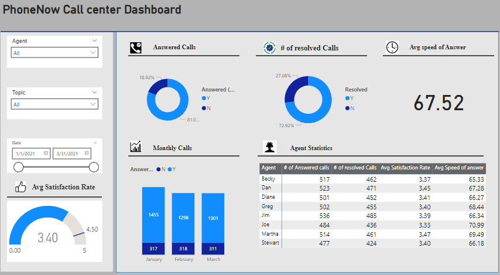

## Call Centre Analysis

### Project Overwiew
The Call Centre Dashboard project aims to deliver a comprehensive and interactive visualization of key performance metrics to enhance decision-making and operational transparency.
The primary goal is to analyze and present data such as call volumes, answered calls, resolved calls, customer satisfaction levels, and agents statistics.
By leveraging data visualization techniques, the project will transform raw call center data into actionable insights. This dashboard will enable the Call Centre Manager to monitor performance efficiently, identify areas for improvement, and support strategic discussions with management. The ultimate objective is to provide a clear and accurate representation of call center trends to drive better outcomes and improve customer experience.

### Problem Statement
The Call Centre Manager lacks a clear and effective visualization of the center's performance metrics. This makes it challenging to identify trends, understand agent and customer behavior, and make informed decisions. A visually engaging and data-driven dashboard is needed to provide clarity and actionable insights.

### Skills Demonstrated
  - Cleaned and prepared raw call center data for analysis, ensuring accuracy and consistency using power querry editor.
  - Performed statistical calculations to analyze trends like  rates and customer satisfaction scores.
  - Utilized **DAX (Data Analysis Expressions)** to calculate measures, such as average speed of answer and agent performance metrics.
    - `Answered calls = CALCULATE(
DISTINCTCOUNT('Call Center'[Call Id]),
FILTER('Call Center','Call Center'[Answered (Y/N)] ="Y"))`
     - `# of resolved = Calculate(distinctcount('Call Center'[Call Id]),Filter('Call Center','Call Center'[Resolved]="Y"))`
     - `Overal satisfaction = 
AVERAGE('Call Center'[Satisfaction rating])`
 - **Data Visualization** Designed an interactive and visually engaging dashboard to showcase key performance metrics.

### Data sources

