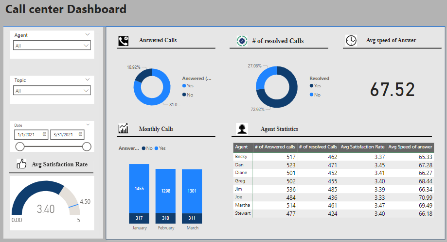

## Call Centre Analysis

### Project Overview
The Call Centre Dashboard project aims to deliver a comprehensive and interactive visualization of key performance metrics to enhance decision-making and operational transparency.
The primary goal is to analyze and present data such as call volumes, answered calls, resolved calls, customer satisfaction levels, and agents statistics.
By leveraging data visualization techniques, the project will transform raw call center data into actionable insights. This dashboard will enable the Call Centre Manager to monitor performance efficiently, identify areas for improvement, and support strategic discussions with management. The ultimate objective is to provide a clear and accurate representation of call center trends to drive better outcomes and improve customer experience.

### Problem Statement
The Call Centre Manager lacks clear and effective performance visualizations, making it difficult to monitor trends, understand agent and customer behavior, and make data-driven decisions. A robust, data-driven dashboard is essential to bridge this gap and improve operational insights.

### Skills Demonstrated
  - Data cleaning and transformation in power query editor.
  - **DAX (Data Analysis Expressions)**.
 - **Data Visualization in power BI**.
 - Defining KPIs.

### Data sources

Data sets for this project were provided by [PWC](https://www.pwc.ch/en/careers-with-pwc/students/virtual-case-experience.html) and call centre data sets: 
[datasets](Call-Center-Dataset.xlsx)
The dataset for this project has ten columns and five thousand rows.

 ### Data Transformation and Modelling
 
  - Used Power Query Editor to clean and prepare raw call center data for analysis..
  - Addressed missing data issues by replacing blank call durations with "0" for abandoned calls.
  - Extracted month from the date column for trend analysis.
  - Standardized and unified data formats to ensure consistency and accuracy.
  - The data was in one table so there was no need to model the data.

  ### Data Anaysis and Visualization  
  
  - Established key performance metrics to measure call center performance, such as Answered Calls Rate, Resolution Rate, Average Speed of Answer, and Satisfaction Scores.
  - Utilized **DAX (Data Analysis Expressions)** to create calculated measures to analyze call center performance, such
  	- `Answered calls = CALCULATE(
DISTINCTCOUNT('Call Center'[Call Id]),
FILTER('Call Center','Call Center'[Answered (Y/N)] ="Yes"))`
     - `# of resolved = Calculate(distinctcount('Call Center'[Call Id]),Filter('Call Center','Call Center'[Resolved]="Yes"))`
     - `Overal satisfaction = 
AVERAGE('Call Center'[Satisfaction rating])`
 - **Data Visualization**

   Designed an interactive and user-friendly dashboard in Power BI that includes:
Key performance indicators (KPIs) like Answered Calls, Resolved Calls, Average Speed of Answer, and Average Satisfaction Rate.
Visualizations:
    - Pie Charts for Answered vs. Unanswered Calls and Resolved vs. Unresolved Calls.
    - Bar Charts for monthly call trends.
    - Tables for agent performance metrics.
    - Filters for Agent, Topic, and Date Range to allow for dynamic exploration of data.
  
      

		[Dashboard](Call-Center-Dashboard.pbix)
  
   ### Conclusion and recommendations
   
   ### Key Insights
 - **Answered Calls vs Unanswered Calls**
	  Answered Calls account for approximately 81.98% of the total calls, while 18.02% remain unanswered.
   
	**Recommendation**
    Investigate the cause of the 18% unanswered calls.

   **Resolved Calls**
	    Resolved Calls make up 72.92%, with 27.08% unresolved.

    **Recommendation**
      Focus on understanding why 27% of the calls are unresolved. Implement additional agent training or guidelines to improve resolution rates.

  - **Average Speed of Answer**
	    The average speed of answer is 67.52 seconds, which seems relatively high for a call center environment.

     **Recommendation**
      Aim to reduce the average speed of answer by optimizing staffing schedules, implementing automated responses for simple queries, or introducing a call-back option.

 - **Average Satisfaction Rate** 
	    The overall average satisfaction rate is 3.40 while target is 4.5, which is moderate but leaves room for improvement.
   
   **Recommendation**
   
      Conduct customer feedback analysis to identify recurring issues. Focus on improving resolution times and training agents on empathy and problem-solving

  

